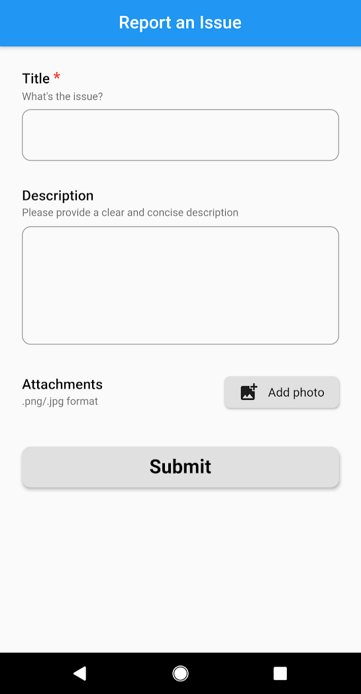
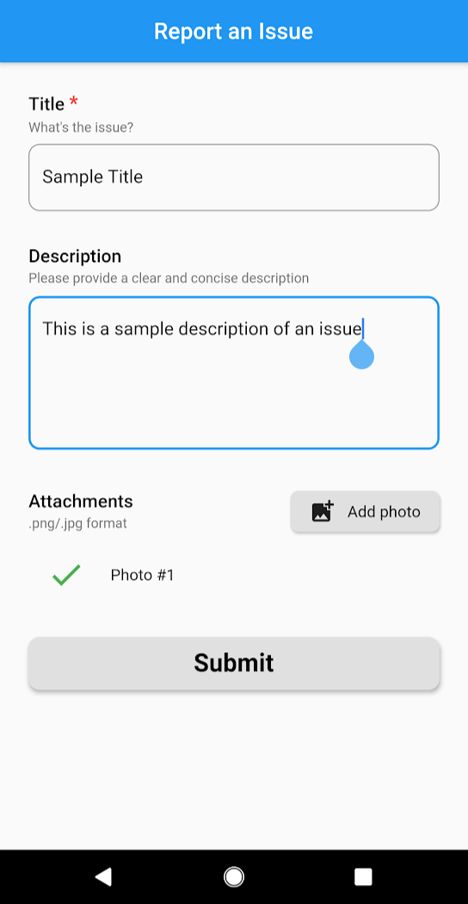
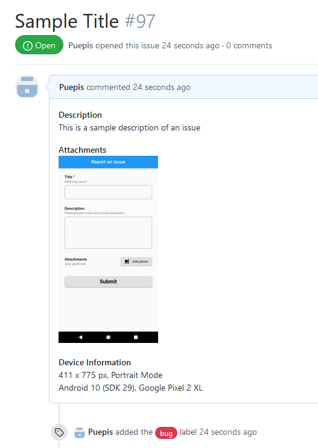

# example

A sample application demonstrating the usage of the bug_report package.

<p float="left">



</p>

## Getting Started

First, add the following to your `pubspec.yaml`:
```Dart
dependencies:
    bug_report: ^0.1.0
```
Next, import the library:
```Dart
import 'package:bug_report/bug_report.dart
```
Finally, use it in your app:

### Example Page
```Dart
class ReportIssuePage extends StatelessWidget {
  const ReportIssuePage({Key key}) : super(key: key);

  @override
  Widget build(BuildContext context) {
    return Scaffold(
      appBar: AppBar(
        centerTitle: true,
        title: Text("Report an Issue"),
      ),
      body: Padding(
        padding: const EdgeInsets.all(20),
        child: IssueForm(
          owner: "YOUR_GITHUB_USERNAME", // e.g. Puepis
          repositoryName: "YOUR_REPOSITORY_NAME", // e.g. bug_report
          authToken: "YOUR_PERSONAL_GITHUB_TOKEN", // keep it safe! 
        ),
      ),
    );
  }
}
```
